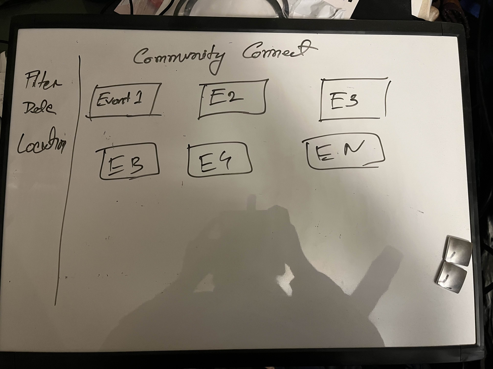
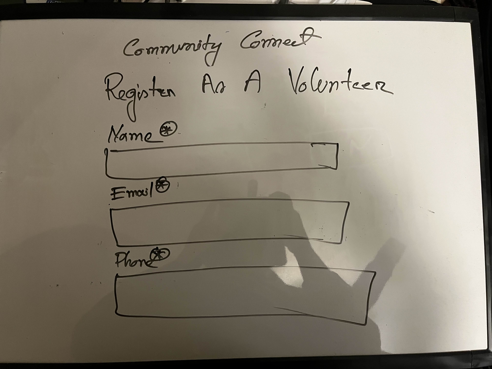
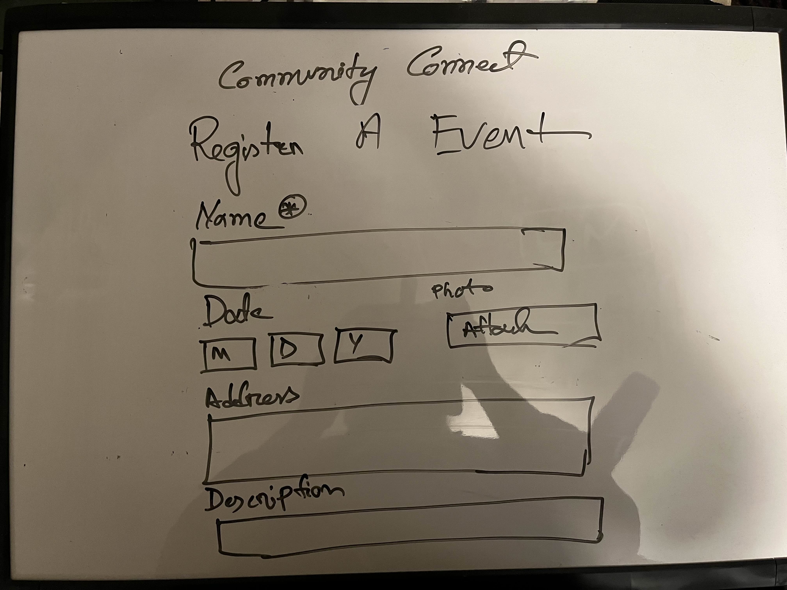
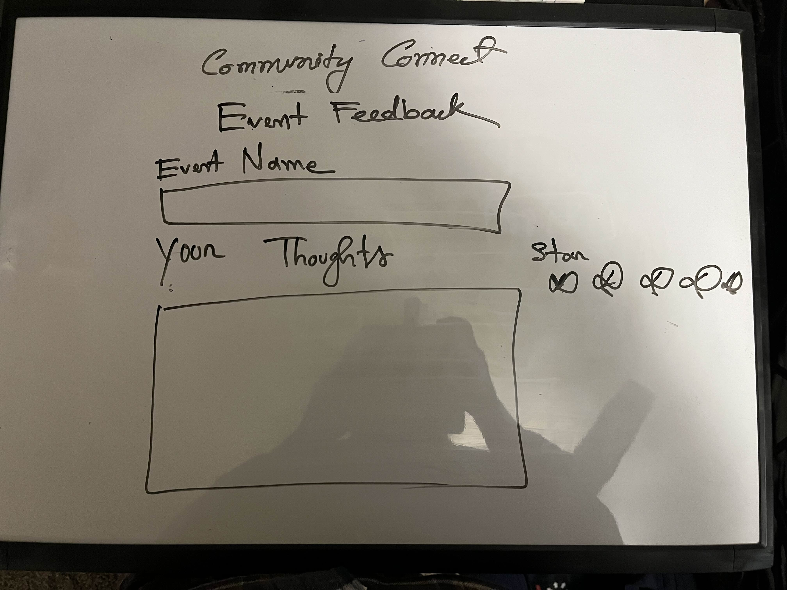
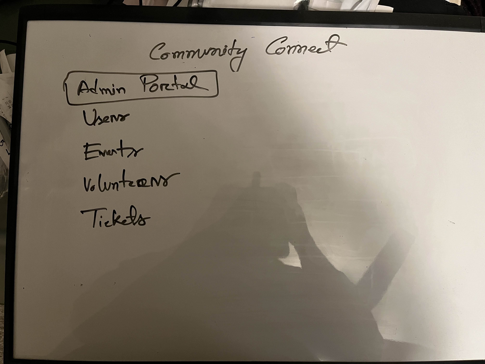
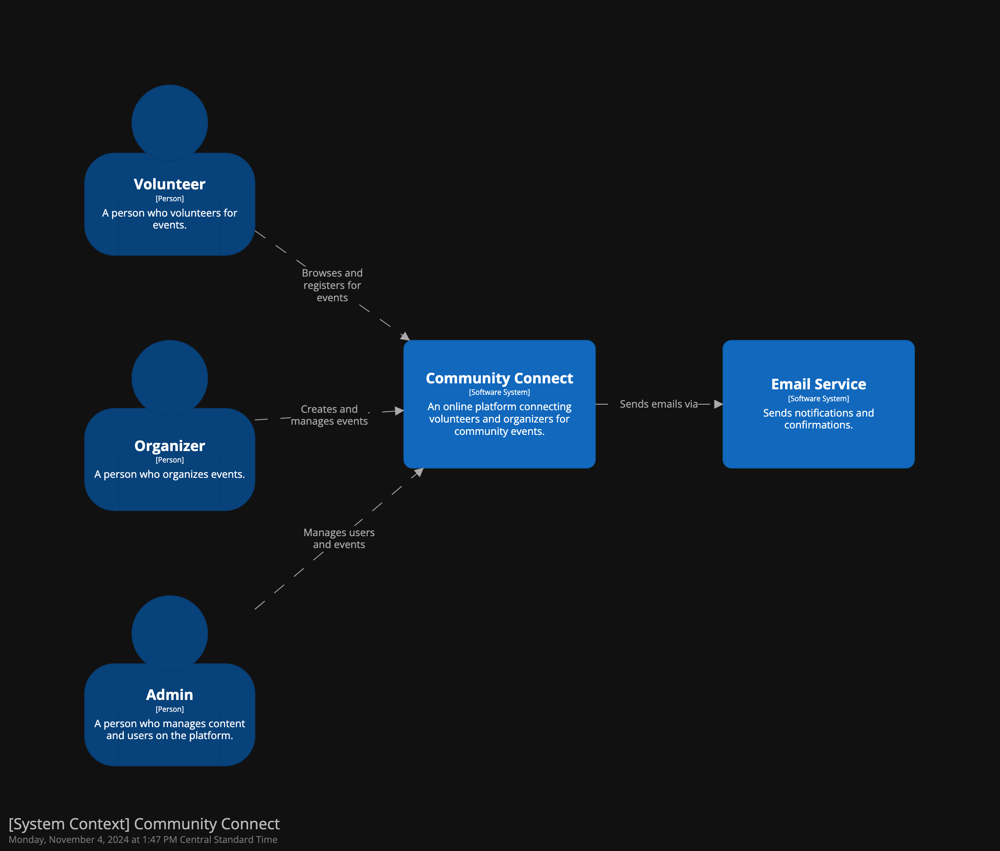
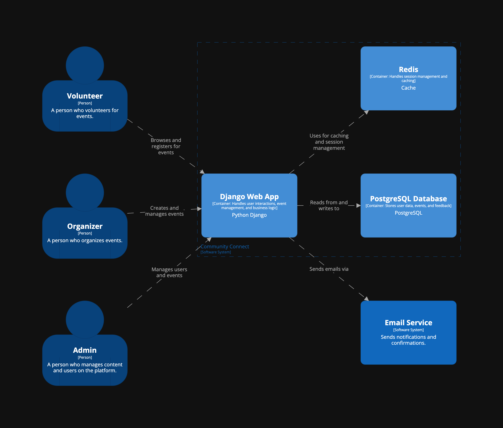
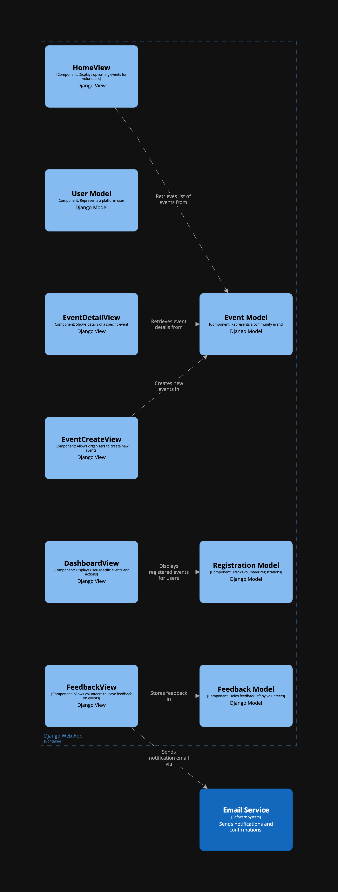

# Community Connect User Stories and Mis-User Stories

## User Stories

### Story 1: Volunteer Browsing Events
As a **volunteer**, I want to **browse community service events** so I can **find opportunities that align with my interests**.

**Acceptance Criteria:**
- Volunteers can view a list of upcoming events with details such as title, description, date, location, and organizer name.
- The events are displayed in chronological order and can be filtered by location, category, and date.

---

### Story 2: Volunteer Registration for Events
As a **volunteer**, I want to **register for an event** so I can **participate and track my engagement history**.

**Acceptance Criteria:**
- Volunteers can register for an event by clicking a “Register” button and confirming their participation.
- Upon successful registration, volunteers receive a confirmation email with event details.
- Registered events are added to the volunteer’s “My Events” dashboard for easy access.

---

### Story 3: Organizer Event Creation
As an **organizer**, I want to **create and manage events** so I can **attract volunteers to my community service initiatives**.

**Acceptance Criteria:**
- Organizers can create events by filling out a form with fields like title, description, date, location, and volunteer requirements.
- Organizers can edit or cancel events, and registered volunteers receive a notification of any changes.

---

### Story 4: Admin User Management
As an **admin**, I want to **monitor user activity and manage content** so I can **ensure platform safety and relevance**.

**Acceptance Criteria:**
- Admins can view a list of users and see their roles (volunteer, organizer, admin).
- Admins can deactivate users, moderate event content, and resolve any issues reported by users.

---

### Story 5: Volunteer Event Feedback
As a **volunteer**, I want to **leave feedback on events I participated in** so I can **share my experience and help others make informed decisions**.

**Acceptance Criteria:**
- After an event, volunteers can submit feedback with a rating (1-5 stars) and a brief comment.
- Feedback is displayed publicly on the event’s page and is visible to future volunteers.

---

## Mis-User Stories and Mitigation Strategies

### Mis-User Story 1: Spam Registrations
As a **malicious user**, I want to **register for multiple events under fake identities** so I can **disrupt event organization and take up volunteer slots unfairly**.

**Mitigation Criteria:**
- Implement CAPTCHA for registration to deter bots and fake sign-ups.
- Limit the number of events a single user can register for within a short time period (e.g., five events in a day).

---

### Mis-User Story 2: Posting Inappropriate Content
As a **malicious organizer**, I want to **post misleading or inappropriate content in event descriptions** so I can **potentially harm volunteers or mislead the community**.

**Mitigation Criteria:**
- Require admin approval for new organizers before allowing event postings.
- Enable a report system where users can flag suspicious or inappropriate content, and alerts are sent to admins for review.

---

### Mis-User Story 3: Unauthorized Access to User Data
As an **unauthorized user**, I want to **access other users’ personal data and activity logs** so I can **potentially misuse sensitive information**.

**Mitigation Criteria:**
- Enforce strict role-based access controls to ensure that only authorized users (like admins) can view sensitive data.
- Use secure authentication methods (e.g., two-factor authentication) to prevent unauthorized access.

---

### Mis-User Story 4: Event Spam by Bots
As a **bot or malicious user**, I want to **create multiple fake events** so I can **overwhelm the platform with spam and render it unusable**.

**Mitigation Criteria:**
- Implement CAPTCHA for event creation and restrict organizers to a reasonable number of active events.
- Monitor and flag repeated content submissions and add the capability to temporarily ban or warn users exhibiting spammy behavior.

---
## Mockups
### System Context

### System Context

### System Context

### System Context

### System Context

## C4 Diagram
### System Context

### System Container

### System Component

